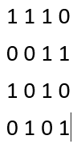

**
TUGAS HALFTONING:PATTERNING DAN DITTERING 
**
 

 

 Oleh: 

 Nama: Rahma Fauziah Hayani

 NIM: 2310131120007

 

 Dosen Pengampu: 

 Dr. Harja Santanapurba, M.kom

 Novan Alkaf Bahraini Saputra,S.kom., M.T

 

    <strong>
PROGRAM STUDI PENDIDIKAN KOMPUTER</strong>
    <strong>
FAKULTAS KEGURUAN DAN ILMU PENDIDIKAN</strong>
    <strong>
UNIVERSITAS LAMBUNG MANGKURAT</strong>
    <strong>
2024</strong>

 
 

# Halftoning

Halftoning adalah sebuah teknik yang digunakan untuk memproduksi gambar dengan warna abu-abu atau warna yang lebih sedikit menggunakan hanya dua warna (hitam dan putih). Teknik ini biasanya digunakan dalam pencetakan, fotografi digital, dan pengiriman data gambar. Teknik ini digunakan dalam printer, serta industri penerbitan. Jika Anda memeriksa sebuah foto di koran, Anda akan melihat bahwa gambar itu terdiri dari titik-titik hitam meskipun tampaknya terdiri dari abu-abu. Hal ini dimungkinkan karena integrasi spasial yang dilakukan oleh mata kita. Mata kita memadukan detail halus dan merekam intensitas keseluruhan. Semakin banyak jumlah titik hitam dalam sel halftone, semakin gelap sel tersebut tampak. Contohnya, pada Gambar 4, titik kecil yang terletak di bagian tengah disimulasikan dalam halftoning digital dengan mengisi sel halftone bagian tengah; demikian juga, titik ukuran sedang yang terletak di sudut kiri atas, disimulasikan dengan mengisi empat sel di sudut kiri atas. Titik besar yang mencakup sebagian besar area pada gambar ketiga disimulasikan dengan mengisi semua sel halftone.

**Ada dua metode utama dalam halftoning:**

# 1. Patterning

---

Patterning adalah teknik halftoning yang menggunakan pola khusus (seperti titik, garis, atau bentuk lain) untuk menciptakan kesan warna abu-abu. patterning dikenal sebagai pola melibatkan penggantian setiap pixel dengan pola yang diambil dari font binner. Patterning merupakan salah satu teknik sederhana untuk mendigitalisasi halftoning dengan merubah ukuran pixelnya. Misal yang awalnya berukuran 2x2, maka ketika dilakukan patterning ukurannya jadi berubah dimana setiap 1 pixel menjadi ukuran 2x2, maka ukuran akhirnya yang awalnya 2x2 menjadi 6x6.
Jika terdapat font binner 4x4, maka banyaknya pola yang didapat adalah (4x4)+1 = 17. Artinya, untuk pola paterning 4x4 ada sebanyak 17 pola yang berbeda. batas tiap pola dapat kita hitung dengan cara jumlah warna dibagi banyaknya pola = 256 / 17 = 15,05, kita bulatkan menjadi 15 (256 di dapat pada ukuran gambar 8 bit atau 8 pangkat 2 = 256 warna). Artinya, setiap pola memiliki rentang 15 angka yang dimulai dari angka 0.

Pada bagian ini, proses pengisian pola dijelaskan. Gambar sebelah kiri menunjukkan gambar yang sudah diubah ke dalam bentuk angka yang ada di dalam kotak. Di mana setiap angka mewakili tingkat kegelapan pada bagian tertentu dari gambar asli. Angka-angka ini digunakan sebagai petunjuk untuk memilih atau mencocokan pola yang tepat dari matriks pola di sebelah kanan. Pola yang dipilih kemudian digunakan untuk menggantikan bagian gambar sesuai dengan tingkat kegelapan yang diinginkan, menghasilkan gambar akhir yang terdiri dari titik-titik kecil yang menciptakan efek gradasi.

Gambar patterning:

pseudocodenya:

1. Baca gambar 'bunga.jpg' dan simpan sebagai variabel img
2. Dapatkan ukuran gambar (m, n, k) menggunakan fungsi size
3. Periksa apakah gambar berwarna atau grayscale:
   - Jika gambar memiliki 3 dimensi (RGB), konversi gambar menjadi grayscale
4. Buat pola berulang 2x2:
   - Definisikan pola dasar [1 0; 0 1]
   - Ulangi pola tersebut sehingga memiliki ukuran sebesar (m/2) x (n/2) menggunakan fungsi repmat
5. Periksa apakah gambar asli berwarna (RGB):
   - Jika ya, sesuaikan dimensi pola menjadi [m, n, 3] menggunakan repmat untuk mencocokkan dengan tiga channel warna
6. Lakukan proses patterning:
   - Kalikan nilai gambar grayscale dengan pola yang sudah dibuat
   - Konversi hasilnya ke tipe data uint8
7. Tampilkan gambar hasil patterning dengan fungsi imshow dan beri judul 'Patterning'

# 2. Dithering

---

Teknik lain yang digunakan untuk menghasilkan gambar halftoning digital adalah dithering. Tidak seperti patterning, dithering menciptakan gambar output dengan jumlah titik yang sama dengan jumlah piksel dalam gambar sumber. Dithering dapat dianggap sebagai thresholding gambar sumber dengan matriks dither. Matriks diletakkan berulang kali di atas gambar sumber. Di mana pun nilai piksel gambar lebih besar daripada nilai dalam matriks, titik pada gambar output akan terisi. Masalah yang terkenal dari dithering adalah menghasilkan artefak pola yang diperkenalkan oleh matriks thresholding yang tetap. Gambar di bawah ini menunjukkan contoh operasi dithering.

Gambar ini menunjukkan proses dithering untuk menghasilkan gambar akhir yang terdiri dari titik-titik hitam dan putih.

- Input Image:
  Gambar di sebelah kiri adalah gambar input yang terdiri dari nilai intensitas warna. Setiap angka mewakili tingkat kecerahan pada posisi tertentu; semakin tinggi angkanya, semakin terang area tersebut.

- Repeated Dither Matrix (Matriks Dither Berulang):
  Gambar di tengah menunjukkan dither matrix yang digunakan untuk mengubah gambar input menjadi gambar hitam-putih. Matriks ini berulang dan berisi nilai ambang batas tertentu yang digunakan untuk menentukan apakah bagian gambar akan berwarna hitam atau putih.

- Output Image:
  Gambar di sebelah kanan adalah hasil akhir setelah proses dithering. Setiap nilai dari gambar input dibandingkan dengan nilai di matriks dither. Jika nilai dari gambar input lebih besar dari nilai pada matriks dither, maka sel tersebut diisi dengan warna putih. Jika nilainya lebih kecil atau sama, sel tersebut diisi dengan warna hitam.

Secara keseluruhan, proses ini mengubah gambar bergradasi (input image) menjadi gambar hitam-putih (output image) dengan menggunakan pola dari dither matrix untuk menciptakan efek gradasi visual.

### Menghitung dithering menggunakan matriks Thersholding

Thresholding adalah teknik dalam pengolahan citra yang digunakan untuk mengubah gambar bergradasi (gambaran dengan berbagai tingkat keabuan atau warna) menjadi gambar biner, hanya terdiri dari dua nilai, biasanya hitam(0) dan putih(1).Mari kita gunakan matriks ini untuk melakukan dithering pada sebuah gambar grayscale:

- Nilai piksel dalam gambar grayscale biasanya berkisar dari 0 (hitam) hingga 255 (putih).
- Matriks dithering yang Anda berikan memiliki nilai dari 0 hingga 192.
- Menggunakan threshold 128 (setengah dari 255) untuk menentukan apakah piksel akan menjadi hitam atau putih.

Nilai piksel putih = 1, Nilai piksel hitam = 0

Jika nilai piksel > threshold, maka hasilnya putih (1) dan Jika nilai piksel ≤ threshold, maka hasilnya hitam (0)

Karena D1 adalah

- (kanan) D1-1 + 0 x 2^(8-2) = 0 dalam citra 8-bit
- (kanan) D1-1 + 3 x 2^(8-2) = 192 dalam citra 8-bit
- (kiri) D1-1 + 2 x 2^(8-2) = 128 dalam citra 8-bit
- (kiri) D1-1 + 1 x 2^(8-2) = 64 dalam citra 8-bit

lalu hasilnya seperti:

##### contoh dengan gambar 2x2:

##### contoh dengan gambar 4x4:

- Contoh soal dengan gambar input (nilai 0-255):

- Terapkan matriks dithering dari gambar input:

- Hasil

Nilai piksel putih = 1, Nilai piksel hitam = 0

Jika nilai piksel > threshold, maka hasilnya putih (1) dan Jika nilai piksel ≤ threshold, maka hasilnya hitam (0)

hasil gambar dari dithering:

pseudocodenya:

1. Baca gambar 'bunga.jpg' dan simpan dalam variabel img
2. Konversi gambar ke grayscale menggunakan fungsi rgb2gray
3. Definisikan matriks dithering 2x2:
   - dither_matrix = [0 128; 192 64]
4. Dapatkan ukuran gambar grayscale (m, n) menggunakan fungsi size
5. Buat matriks dithering yang berukuran sama dengan gambar grayscale:
   - Ulangi dither_matrix menggunakan repmat hingga ukurannya minimal (m/2, n/2)
   - Potong dither_full agar ukurannya persis m x n
6. Lakukan proses dithering:
   - Kurangi setiap pixel dalam gambar grayscale (img) dengan nilai yang sesuai dalam dither_full
   - Bandingkan hasilnya dengan nilai 128 untuk menghasilkan gambar biner (0 atau 1), simpan hasilnya dalam variabel hasil_dithering
7. Tampilkan hasil dithering menggunakan fungsi imshow dan beri judul 'Hasil Dithering'
